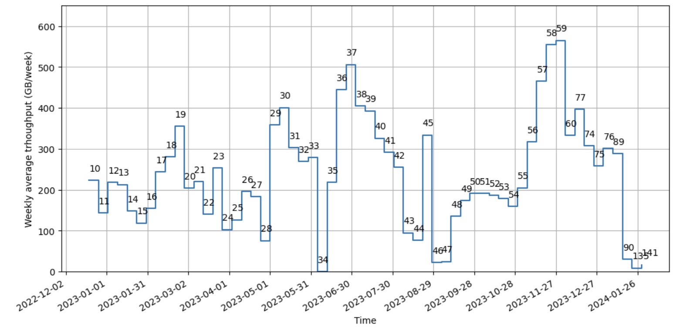

#############################
USDF EFD storage requirements
#############################

.. abstract::

   We analyze the data throughput to the EFD from data collected in 2023, and based on the current project schedule and the InfluxDB Enterprise setup at USDF, we estimate the storage growth for 2024 and 2025.
   The main conclusion from this analysis is that we expect an average throughput of 565 GB/week or 30TB/year during survey operations.
   The short-term recommendation to USDF is to increase the InfluxDB Enterprise cluster's total storage capacity from 60TB to 100TB in 2024, and to 160TB in 2025.
   We hope that the information presented in this document will help the Summit software teams review the CSCs' implementation, aiming to reduce the data throughput, particularly for the MTM1M3 CSC.
   Finally, we recommend monitoring the EFD data throughput regularly to ensure that the storage requirements are sufficient and to inform the USDF with enough time for the necessary upgrades.

Introduction
============

Rubin Observatory generates a large amount of engineering data, which is stored in the Engineering and Facilities Database (EFD). The EFD data is used for real-time monitoring of the observatory systems using Chronograf dashboards, among other tools.

The data is collected at the Summit and replicated to USDF for long-term storage using `Sasquatch`_.

In the Summit environment, the EFD data is retained for a nominal period of 30 days. In the USDF environment, however, the data must be retained for the project's lifetime, which imposes significant storage requirements for the database.

Data throughput from the CSCs
=============================

Each CSC produces data in the form of telemetry, events, and commands published to Kafka topics in Sasquatch and then stored in InfluxDB, a time-series database.

The data throughput from the CSCs at a given time is a function of the number of CSCs enabled, the size of the messages produced to each topic, and the frequency at which these messages are produced.

The assumption that the CSCs are always enabled and produce data at a constant rate is not accurate and would lead to an overestimation of the EFD storage requirements, especially considering several years of data collection.
In reality, even during the survey operations CSCs will transition between enable and disable states based on the operational needs the observatory.

A better approach for estimating the EFD storage requirements is based on data collected so far.
In 2023 we had test campaigns for the M1M3, TMA, M2 and AuxTel runs that can be used to measure the actual data trhoughput to the EFD and help to estimate the storage requirements at USDF for the next few years.

Weekly average throughput
-------------------------

A weekly average data throuput smooths out daily fluctuations in the data and aligns well with Summit activities that are planned on a weekly basis.

Because the EFD data is organized in shards partitioned by time, and the duration of a shard in the EFD is seven days, the size of the EFD shards over time is a direct measure of the weekly average throughput.

The size of the shards can be determined using the `influx_inspect`_ disk utility.

.. code-block:: bash

   $ influx_inspect report-disk /var/lib/influxdb/

The current size of the EFD database at USDF is 17.4TB from data collected since 2021-09-13 to the present.
Figure 1 shows the size of the EFD shards for data collected over the past year.

Figure 1 shows an average throughput of 250GB/week and a total of ~13TB collected in 2023.

In 2024, we expect to collect about 50% more data than in 2023 or ~20TB with ComCam being reinstalled on the TMA followed by tests with the TMA, M1M3 and M2.

The largest shard in Figure 1 is shard 59 with 565 GB, corresponding to the week of 2023-11-27 to 2023-12-04 when we collected data from TMA, M1M3, and M2 tests simultaneously with an Auxtel run that week.

Using shard 59 as a reference, 565 GB/week or 30TB/year is probably close to the total throughput we will have during survey operations. This conclusion is supported by the fact that M1M3 is the largest contributor to the EFD data throughput as discussed in the next section.

However, some systems, such as the MTRotator and LSSTCam, have not been fully exercised yet, and it is unclear at this point how much they will contribute to the total throughput. An yearly reevaluation of these results is thus highly recommended.

Relative throughput and the case of M1M3
----------------------------------------

On 2023-12-04, we also measured the relative throughput from the CSCs, which was determined from the size of individual topics retained in Kafka for 72h.

The tables listing the sizes of telemetry and event topics from that period are presented in the Appendix A. Here we summarize those results showing the relative throughput per CSC.

.. csv-table:: Relative throughput of telemetry data per CSC
   :header: "**CSC**", "**Size (MB)**", "**% of total**"
   :widths: 30, 10, 10
   :file: telemetry_csc.csv

This table shows that the MTM1M3 and MTMount CSCs produce the highest telemetry throughtput in the EFD, particularly MTM1M3 is responsible for 84% of the total telemetry throughput.

.. csv-table:: Relative throughput of event data per CSC
   :header: "**CSC**", "**Size (MB)**", "% of total"
   :widths: 30, 10, 10
   :file: logevent_csc.csv

Events represent a smaller fraction, 7% of the total troughput. The MTM1M3 and MTMount CSCs produce the highest throughput event data in the EFD, followed the MTM2 CSC.

This analysis helped us to identify a bug in the MTM1M3 CSC that was producing messages to the ``MTM1M3.logevent_forceActuatorWarning`` event topic at a higher rate than expected (`DM-41835`_). This finding suggests further improvements in the MTM1M3 CSC implementation to reduce the current throughput observed (see also Appendix A).

The data throughput from the CSCs is also shown in Sankey diagrams representing the data flow from each CSC to the EFD for  `telemetry`_ and `events`_  topics. In these visualizations, the line connecting the CSC to its topic represents the relative throughput among the CSCs. The thicker the line, the higher the throughput.

.. _Sasquatch: https://sasquatch.lsst.io/
.. _CSCs: https://ts-xml.lsst.io/sal_interfaces/index.html
.. _telemetry: https://mermaid.live/view#pako:eNqVWWuP4jgW_SuILzO7opDtOI7DN4aq3h5pGKGGrZFGJSGTuCDTSUznQRXd6v--13aSCikSar9AwOf6cR_nHsOPcaBCOZ6N7-7untJApc_RfvaUjka5SL_Ks3mEDwf18ijiUuaz0bOIc2m_PshofyhmIxchZL95icLiMBvx-nMKk8_jaJ8mMgXgL5k2-OUpNavZJe52shBP6VP6-XG-GE3063Snkp2Y70vxKYvECuE7NJpgzPgF6CQFws2gx64Nur2DfGjQHxjEaGhwaE1MhgadoUE6NOgODbKhQa9_MBjwbZQOOf4VOX-oF5mtELUIzt8h6EJke9GLEPGpjN8C718usZepzERcDxOHPKUP6_VoAi9TEWWbMtuVsUwDacYdBsk436xSWSaiiIJ8NGl_msZKhAsZxwbsomFwgudRtspknpeZ_JgF-b8tRJSCzVqVWSDfW7Y88SygZKNYR4MYAOu4qgaQWwDnFoDeAri3AOwWwLsF4LcA_g2Art1hwC1P4l5PJiKV_4hQZcJkf8M-BOFhIPko0PkokN4GrncxHKiuQII6FdgCxlFyjHqBQSaCr03-EYzJlWHSO3yI4tj6ytQyIe51ALkFcC4Ay81SlWkx-vXfI4f8a1J9nBYylokssvMijqAffZYiK3ZSFNbQI7oqP8tXcVShLsnqcXpUeVREKl0XoihzA_adS8eG51QA48jK8Q5z2WCJg1eCJNRQSrCBLhdrjYG39iCjhioWIgHG0-P2CRpkmm7zQ1kUMtvey1Nkuc4lmFzFh-LbNlFpVKhsu4YXi6acXkU_q0DE2yNkiNx-kbuNKoBtdWYZK79njY5VPj_Bt3u5kcmRaUNmPLxY1Ib10-XmymS7yWQaRuneGDmI3j7ROyPXbPFeJVKb6PcmihrAsZ71yla-lSLcqdft6v6_W_fRQF2d8Vegg07inHCTAMXeRL7YTxOdgm8p5OOPeKMOle_oNtuT1kBL6_J4jM_rc17IxOCNArtxQEIf7y3Y6Z88ELsolQXCCG8OMkuE7ZOg-PjgAr99-mKBpJocL50NpHj9NH2O1ctSFtZfGDmMX43zSQRlmViMS65jjrXbMfJ1YPuOopKj7qYyhO5awT-Qy4sgrMBOP7XUmqTMIM_kf-JzoOK_RHM6n3JjSowDyPS7hAAf5uk-lhXAZ518CcoMUrrYgFCSrbwBGUyve956artQcVjrJkJvIcnHkNlZDQPbeUX5YyXMqtDXpy5ECn4qHlJ958hWVUHaYwFvo17vivI1iiMBxG2zMW-nIvG079oC8BOklh3yOb-2g08qq8QhRbQ_YaBdnITe4n0WneTFohT35Gu7fIEWLngJUwf3p1DdQxZKxbWBi7ULr_g7kzuT9XqNo_WgS72Ou4F5AVs06pH7V-MxD4pSwH7XhaymYtVUJh3N2zSFdcP59wd7fM562KvDLwuD9g1Z9Bw7F8-yaFEX9v0BtNbGhmUt41lVQWm_gfgeJWVxeBdBgj330hvtBkEIGiSSJkLE8aqQ1tOI10jE71xK3MoHLZfmX88P6SnKlLkdGxS4lX-kuRqR4ZgoXUiHVOTnpDhsE2dr-s1SwSaqejP7cCizDbWtNyCqPXCKPNqFA-RbKe8laMRKwfCqyroUvzc0uCqTo8FRamumNZdZdavTanuxLMMMDeZARQStgFIrFbqRuEY2lLkD0a0yBlaI5V-ZsHtnHrtpYYCcYXabUCzUszfTd_74U-TJGaJ44RIfD2R5YLLkYssucm1za08vhb5LhibOjzJWQVSYGnIxfhfnGrwx8W6hevYAs32FqlhF1skudkk_OImyTGULdapEpesMNNcW-A9YJK8sBvwRymOsztodq1gUzypLrBEjfn90dkLfiWoNSV3GP9oZrAHH7T4U65-6UphtXWTRV_nWwRkj70qwyMQ_MoCgmGjoZOOtqWC1ACYJPkUyDmE6me5ttjGvbnA3qU_DPXCyCcnj0pQpvIFv80DGmleU3Z5Hjda80XMM0jOy5v735XI00a_TvDkkJ8TyYnOfah6b49i6hSrwSE0frSPAp-n-nKl7UQgrqZ0eJT7Ucn3kDDBJoY4Pabiwd0grhTlmPZuJ0gBYH64SoOrqTcE9wqGox0CVhU5YdXxDM267wBWvCOhn4JOaHTCCxkL7sFV7qRQhGipLaUnEIrHr9vn6-NZVm_06yK1mfo8XAeSNzDr-gJvvRRUc2z9fUQexPmdFSd5MQrm5vjSTZBKKGJL4c5lEYcVYBBHmtn_4C-XLSkVVH4VBy9eg9BeV7FeZduHFF1MBkkvt64UJiGvSt8GDyMKjXqDu7Y0VbaTEgNXSJmhjxAmrEueiXTXKFIiKWEpu3QmKKJHzNIRJDMbBLrMObamKLgYmemvP3ZhHYb0hh9H67PWGoL8ulZYmubncGpTneLy7Yudm6xJsrlVNZDo61KUY91a8qQIZLs5QapC1xh0VdfuEXfb3dkGaq9QmMUdxuVd3k64iSaJXIIZHEZ_MVhjiXkcTw6Htos2ZmQuyvSuHe25njDmUXPXPqqUumedxjw174O3kwBke7kpVXatvq_qYMd6H-CJeekF2T78v14bPGUIdFz_rXfxm-qJsIDDJOjjIsITyH02ax6na5TI76dI465WtAWcuRwPqUPPj5jJBOGKko83NPh60CtjYO0v1EwokxWVKxEGd0L7rck6v_QhzefHE1Hediwtkm9hW6_vqJslwR-iHUQ56PJC6QtYyzWs6BjpwGB2ObqVb34KMqYtv5sTcNvQLK1rLwl6rh1qrtOxcRIxzhuyqsLetuI_8dmXnR93Jy2QONHr-XjUZ7mDUy4cmkO8YFG5bni2bljI55qFlSih8vzdAliuBcOySLfuwZjYClwl0_YZS2Di0SNDBmpbHk3GiR6JwPBv_0P9lPo0Bm8in8QweQ_ksyrh4Gj-lPwEqykKtz2kwnpk_Ryfj8giLy_tI7DORNN8eRTqe_Ri_jmewpSnHUNc-0CmF--5kfB7P7oiD8RRBoXJEKHIR-zkZf1cKZnCmPkU-pT7zoJw8z3PMdH-bQYgAzC5D3V-W9t9c86fuz_8B5WYZPg
.. _events: https://mermaid.live/view#pako:eNqNVttu4zYQ_RVBL_siBxJ195sgby7ACnZrIwEKAQUj07YaiTQoartukH_vDOVbXNPNC286Z8jRcA7n3a7EktljezQalbwSfFWvxyW3rI7yN7bTQ5hsxN_PtOlZN7ZWtOnYsLxh9XqjxhZxXXdY4WAsa-o1bxmHD98atlLfSq6NDxZHr0zRkpc8WzwyumRyzuTPumKWc7Fw14g1-wlm_oRBwbqOrtnItRwvCeOo5MWi8Ap_Mbecw-hEWDe7SjSzvt3OFVV9hzSfhJGraURTyAnekqzrWPva7J74THS1qgVHSuCn6XGnwz4n2oZRqV4ZVRobBDEp-cMTHAgaIyoMErSYTfXBoTMiozC6ftwLXBIF-DO1xeyWxdAdvJmpNZqEzogkSYI2NTK7jUzB61kxsRxojCh_8GUiWoZbY2_GYpiyPTa7jQ2Ixk6nE-089mYs2n2hqtowaTn7gRGdYpwWrFOWg60JF7kh0VESPVc6UDgwor3hvz6yX3QrlsOV10MjIyH60v4u4CILiTvshyZG7HoE98hpyyTFLYaRGR9q_MumVuwH5jNyTjMjb3_v5ltWKSnWkm43yDyfm7hJGOn_UAguqo0U7eDbxYKRHaOHeX4hHxcLRnaCWvWDdkwuJK3e8DKcz8w8VJ0XmMK1uReSVRQvx8WCiZ3q3Pu65F2wPTc45A8c8y_4w0LuDpl0WjHyCQkOOXXOz77Mj4LbivsJH0YRepvnQ14OvQEbRTrfH5-z3HKwNeGSvXI-F_oA0BmQsauV2JyTVSOqt-lq1bEBD0kGJ7ivXyEOny7zf5ZMO8Z-rKNb5FqGoDMiA4xknh-y8zAy4BPXHxRuxlkPSVFXnRbk48zEg4An11-Prm9bKnf3tG9Ud3oeE19n1eSpKCwHW4Pl1IvQg2k-A1exNeISvHNzENll32CSHYcmBiSJ1rqjOhb_o44pvOgJ7iHrrfqtZz3DXY4TEysO8N98b3RcW6bwcOczEy-Jic6CrJa5aLcSSpJBkT8tGNie6-okemCcybo6xP_T1ETda_q1aF6WRolW84dLbXz4kjYS19ep8H0OsYXm7NIwDq6dFVN-EEdXkRdCQFySmCuouqleqOQ1X-vTEygT0qtFVLfrFGtP-3tw0ORWbVZzCCTm-RlHPxyumbMSsmJZpXp8fM7ORUgYhn6Q2I4NUWppvYRy-R3r3dIG7W9ZaY9huGQrzKnSLvkHQGmvxHzHK3usC2bH7rdLqtikpiAl7XF1S7k9frd_2WNw_y70k9QNYxIR4oWeY-_s8SiO7tw4jlIoojw_SKP0w7H_EQJMeHdRGoDWppGXktQHirb3h_6oZA_m2bIGZ4qhxNeV_se_TrIBWg

EFD storage growth estimation
=============================

The EFD storage requirements are estimated based on the EFD data collected in 2023, current project schedule and also considering the `InfluxDB Enterprise cluster`_ setup, the license model, and safety margins.

In the current InfluxDB Enterprise setup at USDF, we use 2x8-core nodes with 30 TB of local SSD storage each and a replication factor of 2 for redundancy. The InfluxDB Enterprise license model is based on the number of cores used in the cluster. The current production license allows for 16 cores. If needed, we can add two more data nodes to the cluster in a 4x4-core nodes setup to increase the storage capacity while keeping the same replicator factor.

A commonly advised practice is to include a safety margin of around 20% to 50% to account for unexpected data growth.

Table 1 shows the estimated storage growth for the EFD data at the USDF, considering an increase of 20 TB in 2024 and 30TB/year during survey operations, a replication factor of 2, and a safety margin of 15 TB.

.. csv-table:: Estimated storage growth for the EFD at the USDF
   :header: "**Year**", "**RF**", "**Storage size per data node (TB)**", "**Total cluster storage size (TB)**"
   :widths: 10, 5, 10, 10

   2023, 2, 30, 60
   2024, 2, 50, 100
   **2025**, **2**, **80**, **160**
   2026, 2, 110, 220
   2027, 2, 140, 280
   2028, 2, 170, 340
   2029, 2, 200, 400
   2030, 2, 230, 460
   2031, 2, 260, 520
   2032, 2, 290, 580
   2033, 2, 320, 640
   2034, 2, 350, 700
   2035, 2, 380, 760

Recommendations
===============

Considering the current project schedule, we recommend increasing the total cluster storage capacity from 60 TB to 100 TB in 2024 and to 160 TB in 2025 when survey operations start.
The most cost-effective solution to scaling the storage size in the current InfluxDB Enterprise cluster is to add more disks or replace the existing ones with larger-capacity disks.
Current NVMe SSD technology allows 30 TB on a single disk, and storage capacity will continue to increase.
USDF should consider the viability of this solution now to increase the InfluxDB Enterprise cluster storage capacity to 100 TB in 2024 and to 160 TB in 2025.
Currently, the cluster has 60TB of storage capacity and 56% of usage.

To reduce the long-term storage requirements for the EFD, we recommend that the Summit software teams review and optimize the CSCs data throughput.
This can be achieved by reducing the frequency at which the messages are produced and by reducing the size of the messages produced for each topic if possible.
A reduction factor of X in the total CSC throughput reduces the storage requirements for the EFD by 2X for a replication factor of 2 or 4X if a replication factor of 4 is used for the InfluxDB Enterprise cluster in the future.

We recommend monitoring the EFD data throughput and the storage available on the InfluxDB Enterprise cluster on a regular basis and reevalute the conclusions presented in this document to ensure that the storage requirements for the EFD are adequate for the data being collected and to inform USDF with enough time to plan for the necessary upgrades.

We also recommend more investigation and consultation with InfluxData support on how to organize the EFD data at USDF.
A single EFD database is challenging to maintain as the data grows (`DM-39518`_).
Spliting the EFD data into multiple databases improves the data manageability.
A possible approach is to split the EFD data by subsystem (e.g. M1M3, MainTel, AuxTel) and partition larger databases by time (e.g. yearly) to keep the size of each database partition under ~30TB.

.. _DM-41835: https://jira.lsstcorp.org/browse/DM-41835
.. _InfluxDB Enterprise cluster: https://docs.influxdata.com/enterprise_influxdb/v1/concepts/clustering/
.. _influx_inspect: https://docs.influxdata.com/influxdb/v1/tools/influx_inspect/
.. _DM-39518: https://jira.lsstcorp.org/browse/DM-39518

Appendix A
==========

Size of telemetry and event topics stored in Kafka from 2023-12-04 only topics with size greater than 1MB are listed.

.. csv-table:: Size of telemetry topics for data collected on 2023-12-04
   :header-rows: 1
   :widths: 20, 50, 10
   :file: telemetry_topics.csv

.. csv-table:: Size of event topics for data collected on 2023-12-04
   :header-rows: 1
   :widths: 20, 50, 10
   :file: logevent_topics.csv
