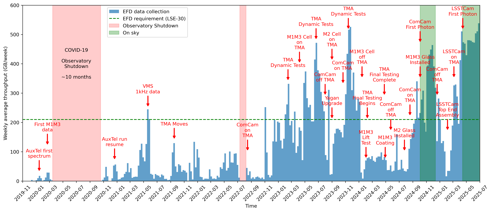

#############################
USDF EFD storage requirements
#############################

.. abstract::

   We have analyzed the EFD data collected over the past few years and estimated the expected storage growth for the EFD at the USDF during survey operations. The peak average throughput observed is approximately 600 GB per week. Assuming this rate remains constant, we project an annual storage growth of about 30 TB.
   As of now, the EFD at the USDF contains approximately 30 TB of data, and we have recently expanded its storage capacity to 100 TB, which should be sufficient through the end of 2026.
   We recommend that the USDF begin planning for a migration from InfluxDB v1 Enterprise to InfluxDB v3 Enterprise. The newer version supports object store for persistence and is generally a better fit for Kubernetes-based deployments.
   Additionally, we believe the information presented in this document can support the T&S software team in reviewing the CSCs' implementations, with a particular focus on optimizing data throughput for the MTM1M3 CSC.
   Finally, we recommend regularly monitoring EFD data rates to ensure storage capacity remains adequate and to inform the USDF of any infrastructure upgrades needed well in advance.

Introduction
============

Rubin Observatory generates a large amount of engineering data, which is stored in the Engineering and Facilities Database (EFD). The EFD data is used for real-time monitoring of the observatory systems using Chronograf dashboards, among other tools.

The data is collected at the Summit and replicated to USDF for long-term storage using `Sasquatch`_.

In the Summit environment, the EFD data is retained for a nominal period of 30 days. In the USDF environment, however, the data must be retained for the project's lifetime, which imposes significant storage requirements for the database.

Data throughput from the CSCs
=============================

Each CSC produces data in the form of telemetry, events, and commands published to Kafka topics in Sasquatch and then stored in InfluxDB, a time-series database.

The data throughput from the CSCs at a given time is a function of the number of CSCs enabled, the size of the messages produced to each topic, and the frequency at which these messages are produced.

The assumption that the CSCs are always enabled and produce data at a constant rate is not accurate and would lead to an overestimation of the EFD storage requirements, especially considering several years of data collection.
In reality, even during the survey operations CSCs will transition between enable and disable states based on the operational needs the observatory.

A better approach for estimating the EFD storage requirements is based on the actual data collection.

Weekly average throughput
-------------------------

A weekly average data throughput smooths out daily fluctuations in the data and aligns well with Summit activities that are planned on a weekly basis.

Because the EFD data is organized in shards partitioned by time, and the duration of a shard in the EFD is seven days, the size of the EFD shards over time is a direct measure of the weekly average throughput.

The size of the shards can be determined using the `influx_inspect`_ disk utility.

.. code-block:: bash

   $ influx_inspect report-disk /var/lib/influxdb/

In 2023 we had test campaigns for the M1M3, TMA, M2 and AuxTel runs that were used to measure the data throughput to the EFD and helped to estimate the storage requirements at USDF for 2024 and 2025. 

Figure 1 shows the size of the EFD shards for data collected over the past few years.
Comparing the amount of data collected during these campaigns with the data collected in late 2024 with ComCam on-sky and early 2025 with LSSTCam on-sky confirms this approach.
We expect a nearly constant data throughput ~600 GB/week during survey operations.

The current size of the EFD database at USDF is 31TB.

   
   Size of EFD shards for data collected over time.

The largest shard in Figure 1 corresponds the the first week of July with 578 GB.

Using this shard reference, 578 GB/week or 30TB/year is probably close to the total throughput we will have during survey operations. This is also supported by the fact that M1M3 is the largest contributor to the EFD data throughput as discussed in the next section.

Relative throughput and the case of M1M3
----------------------------------------

On 2023-12, during a test campaign, we measured the relative throughput from the CSCs, which was determined from the size of individual topics retained in Kafka for 72h. This date was chosen as it coincided with a period of stable operations and high data activity, providing a representative sample for analysis.

The tables listing the sizes of telemetry and event topics from that period are presented in Appendix A. Below is a summary of the relative throughput per CSC based on the measurements.

.. csv-table:: Relative throughput of telemetry data per CSC
   :header: "**CSC**", "**Size (MB)**", "**% of total**"
   :widths: 30, 10, 10
   :file: telemetry_csc.csv

This table shows that the MTM1M3 and MTMount CSCs produce the highest telemetry throughtput in the EFD, particularly MTM1M3 is responsible for 84% of the total telemetry throughput.

.. csv-table:: Relative throughput of event data per CSC
   :header: "**CSC**", "**Size (MB)**", "% of total"
   :widths: 30, 10, 10
   :file: logevent_csc.csv

Events represent a smaller fraction, 7% of the total troughput. The MTM1M3 and MTMount CSCs produce the highest throughput event data in the EFD, followed the MTM2 CSC.

This analysis helped us to identify a bug in the MTM1M3 CSC that was producing messages to the ``MTM1M3.logevent_forceActuatorWarning`` event topic at a higher rate than expected (`DM-41835`_). This finding suggests further improvements in the MTM1M3 CSC implementation to reduce the current throughput observed (see also Appendix A).

The data throughput from the CSCs is also shown in Sankey diagrams representing the data flow from each CSC to the EFD for  `telemetry`_ and `events`_  topics. In these visualizations, the line connecting the CSC to its topic represents the relative throughput among the CSCs. The thicker the line, the higher the throughput.

.. _Sasquatch: https://sasquatch.lsst.io/
.. _CSCs: https://ts-xml.lsst.io/sal_interfaces/index.html
.. _telemetry: https://mermaid.live/view#pako:eNqVWWuP4jgW_SuILzO7opDtOI7DN4aq3h5pGKGGrZFGJSGTuCDTSUznQRXd6v--13aSCikSar9AwOf6cR_nHsOPcaBCOZ6N7-7untJApc_RfvaUjka5SL_Ks3mEDwf18ijiUuaz0bOIc2m_PshofyhmIxchZL95icLiMBvx-nMKk8_jaJ8mMgXgL5k2-OUpNavZJe52shBP6VP6-XG-GE3063Snkp2Y70vxKYvECuE7NJpgzPgF6CQFws2gx64Nur2DfGjQHxjEaGhwaE1MhgadoUE6NOgODbKhQa9_MBjwbZQOOf4VOX-oF5mtELUIzt8h6EJke9GLEPGpjN8C718usZepzERcDxOHPKUP6_VoAi9TEWWbMtuVsUwDacYdBsk436xSWSaiiIJ8NGl_msZKhAsZxwbsomFwgudRtspknpeZ_JgF-b8tRJSCzVqVWSDfW7Y88SygZKNYR4MYAOu4qgaQWwDnFoDeAri3AOwWwLsF4LcA_g2Art1hwC1P4l5PJiKV_4hQZcJkf8M-BOFhIPko0PkokN4GrncxHKiuQII6FdgCxlFyjHqBQSaCr03-EYzJlWHSO3yI4tj6ytQyIe51ALkFcC4Ay81SlWkx-vXfI4f8a1J9nBYylokssvMijqAffZYiK3ZSFNbQI7oqP8tXcVShLsnqcXpUeVREKl0XoihzA_adS8eG51QA48jK8Q5z2WCJg1eCJNRQSrCBLhdrjYG39iCjhioWIgHG0-P2CRpkmm7zQ1kUMtvey1Nkuc4lmFzFh-LbNlFpVKhsu4YXi6acXkU_q0DE2yNkiNx-kbuNKoBtdWYZK79njY5VPj_Bt3u5kcmRaUNmPLxY1Ib10-XmymS7yWQaRuneGDmI3j7ROyPXbPFeJVKb6PcmihrAsZ71yla-lSLcqdft6v6_W_fRQF2d8Vegg07inHCTAMXeRL7YTxOdgm8p5OOPeKMOle_oNtuT1kBL6_J4jM_rc17IxOCNArtxQEIf7y3Y6Z88ELsolQXCCG8OMkuE7ZOg-PjgAr99-mKBpJocL50NpHj9NH2O1ctSFtZfGDmMX43zSQRlmViMS65jjrXbMfJ1YPuOopKj7qYyhO5awT-Qy4sgrMBOP7XUmqTMIM_kf-JzoOK_RHM6n3JjSowDyPS7hAAf5uk-lhXAZ518CcoMUrrYgFCSrbwBGUyve956artQcVjrJkJvIcnHkNlZDQPbeUX5YyXMqtDXpy5ECn4qHlJ958hWVUHaYwFvo17vivI1iiMBxG2zMW-nIvG079oC8BOklh3yOb-2g08qq8QhRbQ_YaBdnITe4n0WneTFohT35Gu7fIEWLngJUwf3p1DdQxZKxbWBi7ULr_g7kzuT9XqNo_WgS72Ou4F5AVs06pH7V-MxD4pSwH7XhaymYtVUJh3N2zSFdcP59wd7fM562KvDLwuD9g1Z9Bw7F8-yaFEX9v0BtNbGhmUt41lVQWm_gfgeJWVxeBdBgj330hvtBkEIGiSSJkLE8aqQ1tOI10jE71xK3MoHLZfmX88P6SnKlLkdGxS4lX-kuRqR4ZgoXUiHVOTnpDhsE2dr-s1SwSaqejP7cCizDbWtNyCqPXCKPNqFA-RbKe8laMRKwfCqyroUvzc0uCqTo8FRamumNZdZdavTanuxLMMMDeZARQStgFIrFbqRuEY2lLkD0a0yBlaI5V-ZsHtnHrtpYYCcYXabUCzUszfTd_74U-TJGaJ44RIfD2R5YLLkYssucm1za08vhb5LhibOjzJWQVSYGnIxfhfnGrwx8W6hevYAs32FqlhF1skudkk_OImyTGULdapEpesMNNcW-A9YJK8sBvwRymOsztodq1gUzypLrBEjfn90dkLfiWoNSV3GP9oZrAHH7T4U65-6UphtXWTRV_nWwRkj70qwyMQ_MoCgmGjoZOOtqWC1ACYJPkUyDmE6me5ttjGvbnA3qU_DPXCyCcnj0pQpvIFv80DGmleU3Z5Hjda80XMM0jOy5v735XI00a_TvDkkJ8TyYnOfah6b49i6hSrwSE0frSPAp-n-nKl7UQgrqZ0eJT7Ucn3kDDBJoY4Pabiwd0grhTlmPZuJ0gBYH64SoOrqTcE9wqGox0CVhU5YdXxDM267wBWvCOhn4JOaHTCCxkL7sFV7qRQhGipLaUnEIrHr9vn6-NZVm_06yK1mfo8XAeSNzDr-gJvvRRUc2z9fUQexPmdFSd5MQrm5vjSTZBKKGJL4c5lEYcVYBBHmtn_4C-XLSkVVH4VBy9eg9BeV7FeZduHFF1MBkkvt64UJiGvSt8GDyMKjXqDu7Y0VbaTEgNXSJmhjxAmrEueiXTXKFIiKWEpu3QmKKJHzNIRJDMbBLrMObamKLgYmemvP3ZhHYb0hh9H67PWGoL8ulZYmubncGpTneLy7Yudm6xJsrlVNZDo61KUY91a8qQIZLs5QapC1xh0VdfuEXfb3dkGaq9QmMUdxuVd3k64iSaJXIIZHEZ_MVhjiXkcTw6Htos2ZmQuyvSuHe25njDmUXPXPqqUumedxjw174O3kwBke7kpVXatvq_qYMd6H-CJeekF2T78v14bPGUIdFz_rXfxm-qJsIDDJOjjIsITyH02ax6na5TI76dI465WtAWcuRwPqUPPj5jJBOGKko83NPh60CtjYO0v1EwokxWVKxEGd0L7rck6v_QhzefHE1Hediwtkm9hW6_vqJslwR-iHUQ56PJC6QtYyzWs6BjpwGB2ObqVb34KMqYtv5sTcNvQLK1rLwl6rh1qrtOxcRIxzhuyqsLetuI_8dmXnR93Jy2QONHr-XjUZ7mDUy4cmkO8YFG5bni2bljI55qFlSih8vzdAliuBcOySLfuwZjYClwl0_YZS2Di0SNDBmpbHk3GiR6JwPBv_0P9lPo0Bm8in8QweQ_ksyrh4Gj-lPwEqykKtz2kwnpk_Ryfj8giLy_tI7DORNN8eRTqe_Ri_jmewpSnHUNc-0CmF--5kfB7P7oiD8RRBoXJEKHIR-zkZf1cKZnCmPkU-pT7zoJw8z3PMdH-bQYgAzC5D3V-W9t9c86fuz_8B5WYZPg
.. _events: https://mermaid.live/view#pako:eNqNVttu4zYQ_RVBL_siBxJ195sgby7ACnZrIwEKAQUj07YaiTQoartukH_vDOVbXNPNC286Z8jRcA7n3a7EktljezQalbwSfFWvxyW3rI7yN7bTQ5hsxN_PtOlZN7ZWtOnYsLxh9XqjxhZxXXdY4WAsa-o1bxmHD98atlLfSq6NDxZHr0zRkpc8WzwyumRyzuTPumKWc7Fw14g1-wlm_oRBwbqOrtnItRwvCeOo5MWi8Ap_Mbecw-hEWDe7SjSzvt3OFVV9hzSfhJGraURTyAnekqzrWPva7J74THS1qgVHSuCn6XGnwz4n2oZRqV4ZVRobBDEp-cMTHAgaIyoMErSYTfXBoTMiozC6ftwLXBIF-DO1xeyWxdAdvJmpNZqEzogkSYI2NTK7jUzB61kxsRxojCh_8GUiWoZbY2_GYpiyPTa7jQ2Ixk6nE-089mYs2n2hqtowaTn7gRGdYpwWrFOWg60JF7kh0VESPVc6UDgwor3hvz6yX3QrlsOV10MjIyH60v4u4CILiTvshyZG7HoE98hpyyTFLYaRGR9q_MumVuwH5jNyTjMjb3_v5ltWKSnWkm43yDyfm7hJGOn_UAguqo0U7eDbxYKRHaOHeX4hHxcLRnaCWvWDdkwuJK3e8DKcz8w8VJ0XmMK1uReSVRQvx8WCiZ3q3Pu65F2wPTc45A8c8y_4w0LuDpl0WjHyCQkOOXXOz77Mj4LbivsJH0YRepvnQ14OvQEbRTrfH5-z3HKwNeGSvXI-F_oA0BmQsauV2JyTVSOqt-lq1bEBD0kGJ7ivXyEOny7zf5ZMO8Z-rKNb5FqGoDMiA4xknh-y8zAy4BPXHxRuxlkPSVFXnRbk48zEg4An11-Prm9bKnf3tG9Ud3oeE19n1eSpKCwHW4Pl1IvQg2k-A1exNeISvHNzENll32CSHYcmBiSJ1rqjOhb_o44pvOgJ7iHrrfqtZz3DXY4TEysO8N98b3RcW6bwcOczEy-Jic6CrJa5aLcSSpJBkT8tGNie6-okemCcybo6xP_T1ETda_q1aF6WRolW84dLbXz4kjYS19ep8H0OsYXm7NIwDq6dFVN-EEdXkRdCQFySmCuouqleqOQ1X-vTEygT0qtFVLfrFGtP-3tw0ORWbVZzCCTm-RlHPxyumbMSsmJZpXp8fM7ORUgYhn6Q2I4NUWppvYRy-R3r3dIG7W9ZaY9huGQrzKnSLvkHQGmvxHzHK3usC2bH7rdLqtikpiAl7XF1S7k9frd_2WNw_y70k9QNYxIR4oWeY-_s8SiO7tw4jlIoojw_SKP0w7H_EQJMeHdRGoDWppGXktQHirb3h_6oZA_m2bIGZ4qhxNeV_se_TrIBWg

EFD storage growth estimation
=============================

The EFD storage requirements are estimated based on the EFD data collection (see Figure 1), current project schedule and also considering the `InfluxDB Enterprise cluster`_ setup, the license model, and safety margins.

In the current InfluxDB Enterprise setup at USDF, we use 2x8-core nodes with 100 TB of local SSD storage each and a replication factor of 2 for redundancy. 

The InfluxDB Enterprise license model is based on the number of cores used in the cluster. The current production license allows for 16 cores. If needed, we can add two more data nodes to the cluster in a 4x4-core nodes setup to increase the storage capacity while keeping the same replicator factor.

A commonly advised practice is to include a safety margin of around 20% to 50% to account for unexpected data growth.

Table 1 shows the estimated storage growth for the EFD data at the USDF, considering an increase of 30 TB/year during survey operations, a replication factor of 2, and a safety margin of 15 TB.

.. csv-table:: Estimated storage growth for the EFD at the USDF
   :header: "**Year**", "**RF**",  "**Total storage (TB)**", "**Main drivers**"
   :widths: 10, 5, 10, 50

   2024, 2, 60, M1M3+TMA+M2+AuxTel
   **2025**, **2**, **100**, **Survey Operations**
   2026, 2, 160, Survey Operations
   2035, 2, 700-1000, Survey Operations

Recommendations
===============

We recommend that the USDF begin planning for a migration from InfluxDB v1 Enterprise to InfluxDB v3 Enterprise. 
The newer version supports object store for persistence and is generally a better fit for Kubernetes-based deployments.

Additionally, we believe the information presented in this document can support the T&S software team in reviewing the CSCs' implementations, with a particular focus on optimizing data throughput for the MTM1M3 CSC.
To reduce the long-term storage requirements for the EFD, we recommend that the Summit software teams review and optimize the CSCs data throughput.
This can be achieved by reducing the frequency at which the messages are produced and by reducing the size of the messages produced for each topic if possible.
A reduction factor of X in the total CSC throughput reduces the storage requirements for the EFD by 2X for a replication factor of 2 or 4X if a replication factor of 4 is used for the InfluxDB Enterprise cluster in the future.

Finally, we recommend monitoring the EFD data throughput and the storage available on the InfluxDB Enterprise cluster on a regular basis and reevaluate the conclusions presented in this document to ensure that the storage requirements for the EFD are adequate for the data being collected and to inform USDF of any infrastructure upgrades needed well in advance.

.. _DM-41835: https://jira.lsstcorp.org/browse/DM-41835
.. _InfluxDB Enterprise cluster: https://docs.influxdata.com/enterprise_influxdb/v1/concepts/clustering/
.. _influx_inspect: https://docs.influxdata.com/influxdb/v1/tools/influx_inspect/
.. _DM-39518: https://jira.lsstcorp.org/browse/DM-39518

Appendix A
==========

Size of telemetry and event topics stored in Kafka from 2023-12-04 only topics with size greater than 1MB are listed.

.. csv-table:: Size of telemetry topics for data collected on 2023-12-04
   :header-rows: 1
   :widths: 20, 50, 10
   :file: telemetry_topics.csv

.. csv-table:: Size of event topics for data collected on 2023-12-04
   :header-rows: 1
   :widths: 20, 50, 10
   :file: logevent_topics.csv
